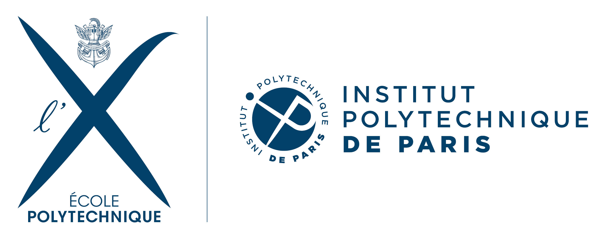
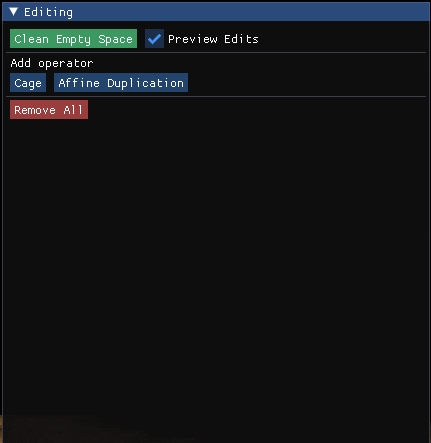
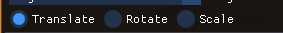
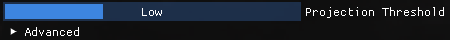
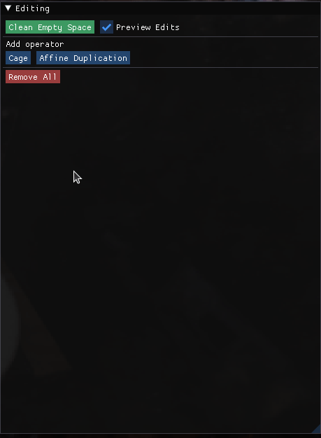

# NeRFshop: Interactive Editing of Neural Radiance Fields
Clément Jambon, Bernhard Kerbl, Georgios Kopanas, Stavros Diolatzis, Thomas Leimkühler, George Drettakis <br>
| [Webpage](https://repo-sam.inria.fr/fungraph/nerfshop/) | [Full Paper](https://repo-sam.inria.fr/fungraph/nerfshop/paper.pdf) | [Dataset](https://repo-sam.inria.fr/fungraph/nerfshop/dataset.zip) | [Video]() | <br>


<a href="https://www.inria.fr/"> </a>
<a href="https://www.polytechnique.edu/"> </a>

<a href="https://univ-cotedazur.eu/"> </a>
<a href="https://www.mpi-inf.mpg.de"> </a>

Abstract: *Neural Radiance Fields (NeRFs) have revolutionized novel view synthesis for captured scenes, with recent methods allowing interactive free-viewpoint navigation and fast training for scene reconstruction. However, the implicit representations used by these methods — often including neural networks and complex encodings — make them difficult to edit. Some initial methods have been proposed, but they suffer from limited editing capabilities and/or from a lack of interactivity, and are thus unsuitable for interactive editing of captured scenes. We tackle both limitations and introduce NeRFshop, a novel end-to-end method that allows users to interactively select and deform objects through cage-based transformations. NeRFshop provides fine scribble-based user control for the selection of regions or objects to edit, semi-automatic cage creation, and interactive volumetric manipulation of scene content thanks to our GPU-friendly two-level interpolation scheme. Further, we introduce a preliminary approach that reduces potential resulting artifacts of these transformations with a volumetric membrane interpolation technique inspired by Poisson image editing and provide a process that "distills" the edits into a standalone NeRF representation.*

## Installation

### Requirements

- An __NVIDIA GPU__; tensor cores increase performance when available. All shown results come from an RTX 3090.
- A __C++14__ capable compiler. The following choices are recommended and have been tested:
  - __Windows:__ Visual Studio 2019 or 2022
  - __Linux:__ GCC/G++ 8 or higher
- A recent version of __[CUDA](https://developer.nvidia.com/cuda-toolkit)__. The following choices are recommended and have been tested:
  - __Windows:__ CUDA 11.5 or higher
  - __Linux:__ CUDA 10.2 or higher
- __[CMake](https://cmake.org/) v3.21 or higher__.
- __(optional) [Python](https://www.python.org/) 3.7 or higher__ for interactive bindings. Also, run `pip install -r requirements.txt`.
- __(optional) [Vulkan SDK](https://vulkan.lunarg.com/)__ for DLSS support.

If you are using Debian based Linux distribution, install the following packages
```sh
sudo apt-get install build-essential git python3-dev python3-pip libopenexr-dev libxi-dev \
                     libglfw3-dev libglew-dev libomp-dev libxinerama-dev libxcursor-dev \
                     xorg-dev libeigen3-dev
```

### Building

First clone the repo, e.g., via git command line with:
```sh
git clone --recursive <link to repository>
```

Then, build with CMake, e.g., via command line:

```sh
cd nerfshop
cmake . -B build
```

If you used CMake to build a solution for your C++ IDE, you may continue by building from inside it (e.g., Microsoft Visual Studio). 
We recommend building RelWithDebInfo as default. Alternatively, you can build a desired configuration (e.g., Release or RelWithDebInfo) directly via command line:
 
```sh
cmake --build build --config RelWithDebInfo -j
```

Run nerfshop from (or ensure that the working directory of the executable is) the cloned repository root.

### Notes on Linux

If CUDA is not on your PATH, you can modify `~/.bashrc` or `~/.zshrc` (or any other shell configuration with) by adding the following lines:
```sh
export PATH="/usr/local/cuda-XX.X/bin:$PATH"
export LD_LIBRARY_PATH="/usr/local/cuda-XX.X/lib64:$LD_LIBRARY_PATH"
```
where `XX.X` stands for your CUDA version (e.g., 11.4).

## Scene loading

As NeRFshop was built directly on top [Instant-NGP](https://nvlabs.github.io/instant-ngp/), pre-processing and loading scenes is done in a similar fashion to the original implementation. Please refer to the corresponding [documentation](https://github.com/NVlabs/instant-ngp/blob/master/docs/nerf_dataset_tips.md#tips-for-training-nerf-models-with-instant-neural-graphics-primitives).

For example, you can start our *statues* scene with:
```sh
./build/nerfshop --scene data/nerfshop_scenes/statues/transforms.json
```

Additionally, if there is a snapshot available, you can load it with:
```sh
./build/nerfshop --scene data/nerfshop_scenes/statues/transforms.json --snapshot data/nerfshop_scenes/statues/base.msgpack
```

**NOTE:** NeRFshop only supports scenes with `aabb_scale`s (as defined [here](https://github.com/NVlabs/instant-ngp/blob/master/docs/nerf_dataset_tips.md#existing-datasets)) ranging from **1 to 16** for now.

## Editing scenes

### Overview
NeRFshop relies on a simple and intuitive workflow made of the successive steps (detailed individually in the following paragraphs):
* [Scribble-based selection](#scribble-based-selection)
* [Region growing](#region-growing)
* [Cage-based deformation](#cage-based-deformation)
* *(Optional)* [Membrane interpolation correction](#optional-membrane-interpolation-correction)
* *(Optional)* [Export via distillation](#optional-export-via-distillation)

Editing is based on composable operators. To instantiate a cage-based operator, push the `Cage` button in the *Editing Window*. An expandable tab should then appear below.



### Scribble-based selection

To select an object keep key `b` pressed down and paint the screen-space region of the object that you wish to capture. Once you're done, push the `PROJECT` to project you're selection on the object in 3D.


### Region growing

Once your selection has been projected, **region growing** (a.k.a. flood feeling) can be performed using the button `GROW REGION`.

You can adjust the number of growing steps for each iteration using the `Growing steps` slider. Note that for now, there is no way to revert a growing iteration. However, you can prune the selection at any time by:
* either keeping `Shift` pressed and capturing points with a rectangle or keeping `Ctrl` pressed and painting the points that you want to select
* removing your current selection by pressing `Delete`
* you can clear you current selection with `Alt`


### Cage-based deformation

When you are statisfied with your current 3D selection, you can run our automatic cage-building algorithm by pushing `COMPUTE PROXY`.


If you wish more control on the cage after it is build, you can tick the `Cage refinement` option, push `EXTRACT CAGE`, edit the resulting cage (similarly to a standard cage-based deformation as described below) and finally hit `COMPUTE PROXY` to derive the final cage.

Once the cage is built, you can manipulate it by:
* SELECTION: either keep `Shift` pressed and capture points with a rectangle or keep `Ctrl` pressed and paint the points that you want to select (the size of the brush can be changed with the mouse wheel). At any time, you can clear your selection with `Alt`
* MANIPULATION: if at least one vertex is selected, a *gizmo* should appear. You can use it to transform your selection.


Supported transformations are translation, rotation and scaling:



Once you are satisfied with your edit, you can visualize the final result by hiding the cage (set the "Operator Visualisation" mode as "Off") and the gizmo (by deselecting all points with "Alt"). Note that if it you have completed all your edits, you can export a standalone NeRF via distillation as described [here](#optional-export-via-distillation).

### *(Optional)* Membrane interpolation correction

In real scenes, artifacts can be carried with the cage when trying to insert a displaced object at a novel location. To mitigate the phenomenon, we propose a *Membrane Interpolation Correction*. To turn it on, make sure you have a valid cage and tick `Apply Membrane Correction`. You can adjust the strength of the correction with the auxiliary slider.


### *(Optional)* Distill and Export

Like with image or 3D geometry editing tools, we offer the possibility to export your edited scene into a standalone NeRF format, namely the format supported by the modern implementation of Instant-NGP (`.ingp`). Once you are happy with your edits, you can click the `Distill` button at the bottom of the Editing window. This will start NeRF training again, but the training will respect the operators you placed. You can stop training when the quality is sufficient for your needs. To save your distilled NeRF so it can be loaded by Instant-NGP-based applications, click the `Save` button in the `Snapshot` section of the main window.

This feature is in alpha and has known limitations. Distilling destructive edits will cause artifacts: a destructive edit is when an object A is moved or deformed such that it (partially) overlaps with another object B, and thus B is (partially) destroyed/overwritten. However, it is possible to first move B out of the way (to some empty space) and then move A to where B used to be. After distilling, you might then make object B vanish (see below). 

### Removing elements

We also provide you with the possibility of removing objects (e.g. floaters). To do so, follow the worklow described above resulting in a proxy that satisfies your needs and hit the `Vanish!` button.


For floaters, you may need a more aggressive *Projection Threshold*. This can be achieved with the dedicated slider as shown below:



Please note that distilling will NOT consider vanished objects! If you need to both deform and remove objects and want to save the result in .ingp format, the suggested workflow is as follows:

1. Train
2. Edit
3. Distill
4. Vanish
5. Save

### Using multiple edits

NeRFshop supports multiple and composable edits. To do so, simply add new operators as specified earlier. In order to control the active operator, use the dedicated slider. 




## Guidelines
* As NeRFshop leverages the occupancy grid introduced by Instant-NGP in order to prune samples along rays, it continually updates the latter as you perform edits. This might result in floating artifacts . To remove them, please press `Clean Empty Space`.
* As Instant-NGP usually struggles with unbounded scenes, we recommend using larger `aabb_scale`.
* NeRFshop can be more demanding in terms of memory compared to Instant-NGP due to its additional rendering routines and datastructures. As a consequence, if you experience any *OUT OF MEMORY*, try to run the pipeline at a small resolution with for example
```sh
./build/nerfshop --scene [SCENE] --height 720 --width 1280
```

## Additional notes
* You can easily change the visualization mode of the current operator (to completely rid of the cage, for example) by using the dedicated selector:


* Simpler edits can be performed using the `Affine Duplication` operator.
* The shortcuts and controls are unchanged (please refer to the [original documentation](https://github.com/NVlabs/instant-ngp#keyboard-shortcuts-and-recommended-controls))

# Instant Neural Graphics Primitives 

 

Ever wanted to train a NeRF model of a fox in under 5 seconds? Or fly around a scene captured from photos of a factory robot? Of course you have!

Here you will find an implementation of four __neural graphics primitives__, being neural radiance fields (NeRF), signed distance functions (SDFs), neural images, and neural volumes.
In each case, we train and render a MLP with multiresolution hash input encoding using the [tiny-cuda-nn](https://github.com/NVlabs/tiny-cuda-nn) framework.

> __Instant Neural Graphics Primitives with a Multiresolution Hash Encoding__  
> [Thomas Müller](https://tom94.net), [Alex Evans](https://research.nvidia.com/person/alex-evans), [Christoph Schied](https://research.nvidia.com/person/christoph-schied), [Alexander Keller](https://research.nvidia.com/person/alex-keller)  
> _ACM Transactions on Graphics (__SIGGRAPH__), July 2022_  
> __[Project page](https://nvlabs.github.io/instant-ngp)&nbsp;/ [Paper](https://nvlabs.github.io/instant-ngp/assets/mueller2022instant.pdf)&nbsp;/ [Video](https://nvlabs.github.io/instant-ngp/assets/mueller2022instant.mp4)&nbsp;/ [BibTeX](https://nvlabs.github.io/instant-ngp/assets/mueller2022instant.bib)__

For business inquiries, please visit our website and submit the form: [NVIDIA Research Licensing](https://www.nvidia.com/en-us/research/inquiries/)


## Requirements

- An __NVIDIA GPU__; tensor cores increase performance when available. All shown results come from an RTX 3090.
- A __C++14__ capable compiler. The following choices are recommended and have been tested:
  - __Windows:__ Visual Studio 2019 or 2022
  - __Linux:__ GCC/G++ 8 or higher
- A recent version of __[CUDA](https://developer.nvidia.com/cuda-toolkit)__. The following choices are recommended and have been tested:
  - __Windows:__ CUDA 11.5 or higher
  - __Linux:__ CUDA 10.2 or higher
- __[CMake](https://cmake.org/) v3.21 or higher__.
- __(optional) [Python](https://www.python.org/) 3.7 or higher__ for interactive bindings. Also, run `pip install -r requirements.txt`.
- __(optional) [Vulkan SDK](https://vulkan.lunarg.com/)__ for DLSS support.


If you are using Debian based Linux distribution, install the following packages
```sh
sudo apt-get install build-essential git python3-dev python3-pip libopenexr-dev libxi-dev \
                     libglfw3-dev libglew-dev libomp-dev libxinerama-dev libxcursor-dev
```

Alternatively, if you are using Arch or Arch derivatives, install the following packages
```sh
sudo pacman -S base-devel cmake openexr libxi glfw openmp libxinerama libxcursor
```

We also recommend installing [CUDA](https://developer.nvidia.com/cuda-toolkit) and [OptiX](https://developer.nvidia.com/optix) in `/usr/local/` and adding the CUDA installation to your PATH.

For example, if you have CUDA 11.4, add the following to your `~/.bashrc`
```sh
export PATH="/usr/local/cuda-11.4/bin:$PATH"
export LD_LIBRARY_PATH="/usr/local/cuda-11.4/lib64:$LD_LIBRARY_PATH"
```

For Arch and derivatives,
```sh
sudo pacman -S cuda
```


## Compilation (Windows & Linux)

Begin by cloning this repository and all its submodules using the following command:
```sh
$ git clone --recursive https://github.com/nvlabs/instant-ngp
$ cd instant-ngp
```

Then, use CMake to build the project: (on Windows, this must be in a [developer command prompt](https://docs.microsoft.com/en-us/cpp/build/building-on-the-command-line?view=msvc-160#developer_command_prompt))
```sh
instant-ngp$ cmake . -B build
instant-ngp$ cmake --build build --config RelWithDebInfo -j 16
```

If the build fails, please consult [this list of possible fixes](https://github.com/NVlabs/instant-ngp#troubleshooting-compile-errors) before opening an issue.

If the build succeeds, you can now run the code via the `build/testbed` executable or the `scripts/run.py` script described below.

If automatic GPU architecture detection fails, (as can happen if you have multiple GPUs installed), set the `TCNN_CUDA_ARCHITECTURES` enivonment variable for the GPU you would like to use. The following table lists the values for common GPUs. If your GPU is not listed, consult [this exhaustive list](https://developer.nvidia.com/cuda-gpus).

| RTX 30X0 | A100 | RTX 20X0 | TITAN V / V100 | GTX 10X0 / TITAN Xp | GTX 9X0 | K80 |
|----------|------|----------|----------------|---------------------|---------|-----|
|       86 |   80 |       75 |             70 |                  61 |      52 |  37 |


## Interactive training and rendering


This codebase comes with an interactive testbed that includes many features beyond our academic publication:
- Additional training features, such as extrinsics and intrinsics optimization.
- Marching cubes for `NeRF->Mesh` and `SDF->Mesh` conversion.
- A spline-based camera path editor to create videos.
- Debug visualizations of the activations of every neuron input and output.
- And many more task-specific settings.
- See also our [one minute demonstration video of the tool](https://nvlabs.github.io/instant-ngp/assets/mueller2022instant.mp4).


### NeRF fox

One test scene is provided in this repository, using a small number of frames from a casually captured phone video:

```sh
instant-ngp$ ./build/testbed --scene data/nerf/fox
```


Alternatively, download any NeRF-compatible scene (e.g. from the [NeRF authors' drive](https://drive.google.com/drive/folders/1JDdLGDruGNXWnM1eqY1FNL9PlStjaKWi), the [SILVR dataset](https://github.com/IDLabMedia/large-lightfields-dataset), or the [DroneDeploy dataset](https://github.com/nickponline/dd-nerf-dataset)).
Now you can run:

```sh
instant-ngp$ ./build/testbed --scene data/nerf_synthetic/lego/transforms_train.json
```

**[To prepare your own dataset for use with our NeRF implementation, click here.](docs/nerf_dataset_tips.md)**

### SDF armadillo

```sh
instant-ngp$ ./build/testbed --scene data/sdf/armadillo.obj
```


### Image of Einstein

```sh
instant-ngp$ ./build/testbed --scene data/image/albert.exr
```


To reproduce the gigapixel results, download, for example, [the Tokyo image](https://www.flickr.com/photos/trevor_dobson_inefekt69/29314390837) and convert it to `.bin` using the `scripts/convert_image.py` script. This custom format improves compatibility and loading speed when resolution is high. Now you can run:

```sh
instant-ngp$ ./build/testbed --scene data/image/tokyo.bin
```


### Volume renderer

Download the [nanovdb volume for the Disney cloud](https://drive.google.com/drive/folders/1SuycSAOSG64k2KLV7oWgyNWyCvZAkafK?usp=sharing), which is derived [from here](https://disneyanimation.com/data-sets/?drawer=/resources/clouds/) ([CC BY-SA 3.0](https://media.disneyanimation.com/uploads/production/data_set_asset/6/asset/License_Cloud.pdf)).

```sh
instant-ngp$ ./build/testbed --mode volume --scene data/volume/wdas_cloud_quarter.nvdb
```


## Python bindings

### DEPRECATED
To conduct controlled experiments in an automated fashion, all features from the interactive testbed (and more!) have Python bindings that can be easily instrumented.
For an example of how the `./build/testbed` application can be implemented and extended from within Python, see `./scripts/run.py`, which supports a superset of the command line arguments that `./build/testbed` does.

If you'd rather build new models from the hash encoding and fast neural networks, consider the [__tiny-cuda-nn__'s PyTorch extension](https://github.com/nvlabs/tiny-cuda-nn#pytorch-extension).

Happy hacking!

### New bindings
Before compiliing the new bindings, make sure you're running python with *pytorch* (>=1.10.0) installed, then:
```sh
instant-ngp$ python setup.py install
```

## Frequently asked questions (FAQ)

__Q:__ How can I run __instant-ngp__ in headless mode?

__A:__ Use `./build/testbed --no-gui` or `python scripts/run.py`. You can also compile without GUI via `cmake -DNGP_BUILD_WITH_GUI=off ...`

##
__Q:__ Does this codebase run on [Google Colab](https://colab.research.google.com/)?

__A:__ Yes. See [this example](https://colab.research.google.com/drive/10TgQ4gyVejlHiinrmm5XOvQQmgVziK3i?usp=sharing) by user [@myagues](https://github.com/NVlabs/instant-ngp/issues/6#issuecomment-1016397579). Caveat: this codebase requires large amounts of GPU RAM and might not fit on your assigned GPU. It will also run slower on older GPUs.

##
__Q:__ Is there a [Docker container](https://www.docker.com/)?

__A:__ Yes. We bundle a [Visual Studio Code development container](https://code.visualstudio.com/docs/remote/containers), the `.devcontainer/Dockerfile` of which you can also use stand-alone. 

If you want to run the container without using VSCode:
```
docker-compose -f .devcontainer/docker-compose.yml build instant-ngp
xhost local:root
docker-compose -f .devcontainer/docker-compose.yml run instant-ngp /bin/bash
```
Then run the build commands above as normal.

##
__Q:__ How can I edit and train the underlying hash encoding or neural network on a new task?

__A:__ Use [__tiny-cuda-nn__'s PyTorch extension](https://github.com/nvlabs/tiny-cuda-nn#pytorch-extension).

##
__Q:__ How can I save the trained model and load it again later?

__A:__ Two options:
1. Use the GUI's "Snapshot" section.
2. Use the Python bindings `load_snapshot` / `save_snapshot` (see `scripts/run.py` for example usage).

##
__Q:__ Can this codebase use multiple GPUs at the same time?

__A:__ No. To select a specific GPU to run on, use the [CUDA_VISIBLE_DEVICES](https://stackoverflow.com/questions/39649102/how-do-i-select-which-gpu-to-run-a-job-on) environment variable. To optimize the _compilation_ for that specific GPU use the [TCNN_CUDA_ARCHITECTURES](https://github.com/NVlabs/instant-ngp#compilation-windows--linux) environment variable.

##
__Q:__ What is the coordinate system convention?

__A:__ See [this helpful diagram](https://github.com/NVlabs/instant-ngp/discussions/153?converting=1#discussioncomment-2187652) by user @jc211.

##
__Q:__ The NeRF reconstruction of my custom dataset looks bad; what can I do?

__A:__ There could be multiple issues:
- COLMAP might have been unable to reconstruct camera poses.
- There might have been movement or blur during capture. Don't treat capture as an artistic task; treat it as photogrammetry. You want _\*as little blur as possible\*_ in your dataset (motion, defocus, or otherwise) and all objects must be _\*static\*_ during the entire capture. Bonus points if you are using a wide-angle lens (iPhone wide angle works well), because it covers more space than narrow lenses.
- The dataset parameters (in particular `aabb_scale`) might have been tuned suboptimally. We recommend starting with `aabb_scale=16` and then decreasing it to `8`, `4`, `2`, and `1` until you get optimal quality.
- Carefully read [our NeRF training & dataset tips](https://github.com/NVlabs/instant-ngp/blob/master/docs/nerf_dataset_tips.md).

##
__Q:__ Why are background colors randomized during NeRF training?

__A:__ Transparency in the training data indicates a desire for transparency in the learned model. Using a solid background color, the model can minimize its loss by simply predicting that background color, rather than transparency (zero density). By randomizing the background colors, the model is _forced_ to learn zero density to let the randomized colors "shine through".


##
__Q:__ How to mask away NeRF training pixels (e.g. for dynamic object removal)?

__A:__ For any training image `xyz.*` with dynamic objects, you can provide a `dynamic_mask_xyz.png` in the same folder. This file must be in PNG format, where _non-zero_ pixel values indicate masked-away regions.

## Troubleshooting compile errors

Before investigating further, make sure all submodules are up-to-date and try compiling again.
```sh
instant-ngp$ git submodule sync --recursive
instant-ngp$ git submodule update --init --recursive
```
If __instant-ngp__ still fails to compile, update CUDA as well as your compiler to the latest versions you can install on your system. It is crucial that you update _both_, as newer CUDA versions are not always compatible with earlier compilers and vice versa.
If your problem persists, consult the following table of known issues.

**\*After each step, delete the `build` folder and let CMake regenerate it before trying again.\***

| Problem | Resolution |
|---------|------------|
| __CMake error:__ No CUDA toolset found / CUDA_ARCHITECTURES is empty for target "cmTC_0c70f" | __Windows:__ the Visual Studio CUDA integration was not installed correctly. Follow [these instructions](https://github.com/mitsuba-renderer/mitsuba2/issues/103#issuecomment-618378963) to fix the problem without re-installing CUDA. ([#18](https://github.com/NVlabs/instant-ngp/issues/18)) |
| | __Linux:__ Environment variables for your CUDA installation are probably incorrectly set. You may work around the issue using ```cmake . -B build -DCMAKE_CUDA_COMPILER=/usr/local/cuda-<your cuda version>/bin/nvcc``` ([#28](https://github.com/NVlabs/instant-ngp/issues/28)) |
| __CMake error:__ No known features for CXX compiler "MSVC" | Reinstall Visual Studio & make sure you run CMake from a developer shell. ([#21](https://github.com/NVlabs/instant-ngp/issues/21)) |
| __Compile error:__ A single input file is required for a non-link phase when an outputfile is specified | Ensure there no spaces in the path to __instant-ngp__. Some build systems seem to have trouble with those. ([#39](https://github.com/NVlabs/instant-ngp/issues/39) [#198](https://github.com/NVlabs/instant-ngp/issues/198)) |
| __Compile error:__ undefined references to "cudaGraphExecUpdate" / identifier "cublasSetWorkspace" is undefined | Update your CUDA installation (which is likely 11.0) to 11.3 or higher. ([#34](https://github.com/NVlabs/instant-ngp/issues/34) [#41](https://github.com/NVlabs/instant-ngp/issues/41) [#42](https://github.com/NVlabs/instant-ngp/issues/42)) |
| __Compile error:__ too few arguments in function call | Update submodules with the above two `git` commands. ([#37](https://github.com/NVlabs/instant-ngp/issues/37) [#52](https://github.com/NVlabs/instant-ngp/issues/52)) |
| __Python error:__ No module named 'pyngp' | It is likely that CMake did not detect your Python installation and therefore did not build `pyngp`. Check CMake logs to verify this. If `pyngp` was built in a different folder than `instant-ngp/build`, Python will be unable to detect it and you have to supply the full path to the import statement. ([#43](https://github.com/NVlabs/instant-ngp/issues/43)) |

If you cannot find your problem in the table, please feel free to [open an issue](https://github.com/NVlabs/instant-ngp/issues/new) and ask for help.

## Thanks

Many thanks to [Jonathan Tremblay](https://research.nvidia.com/person/jonathan-tremblay) and [Andrew Tao](https://developer.nvidia.com/blog/author/atao/) for testing early versions of this codebase and to Arman Toorians and Saurabh Jain for the factory robot dataset.
We also thank [Andrew Webb](https://github.com/grey-area) for noticing that one of the prime numbers in the spatial hash was not actually prime; this has been fixed since.

This project makes use of a number of awesome open source libraries, including:
* [tiny-cuda-nn](https://github.com/NVlabs/tiny-cuda-nn) for fast CUDA networks and input encodings
* [tinyexr](https://github.com/syoyo/tinyexr) for EXR format support
* [tinyobjloader](https://github.com/tinyobjloader/tinyobjloader) for OBJ format support
* [stb_image](https://github.com/nothings/stb) for PNG and JPEG support
* [Dear ImGui](https://github.com/ocornut/imgui) an excellent immediate mode GUI library
* [Eigen](https://eigen.tuxfamily.org/index.php?title=Main_Page) a C++ template library for linear algebra
* [pybind11](https://github.com/pybind/pybind11) for seamless C++ / Python interop
* and others! See the `dependencies` folder.

Many thanks to the authors of these brilliant projects!

## License and Citation

```bibtex
@article{mueller2022instant,
    author = {Thomas M\"uller and Alex Evans and Christoph Schied and Alexander Keller},
    title = {Instant Neural Graphics Primitives with a Multiresolution Hash Encoding},
    journal = {ACM Trans. Graph.},
    issue_date = {July 2022},
    volume = {41},
    number = {4},
    month = jul,
    year = {2022},
    pages = {102:1--102:15},
    articleno = {102},
    numpages = {15},
    url = {https://doi.org/10.1145/3528223.3530127},
    doi = {10.1145/3528223.3530127},
    publisher = {ACM},
    address = {New York, NY, USA},
}
```

Copyright © 2022, NVIDIA Corporation. All rights reserved.

This work is made available under the Nvidia Source Code License-NC. Click [here](LICENSE.txt) to view a copy of this license.
